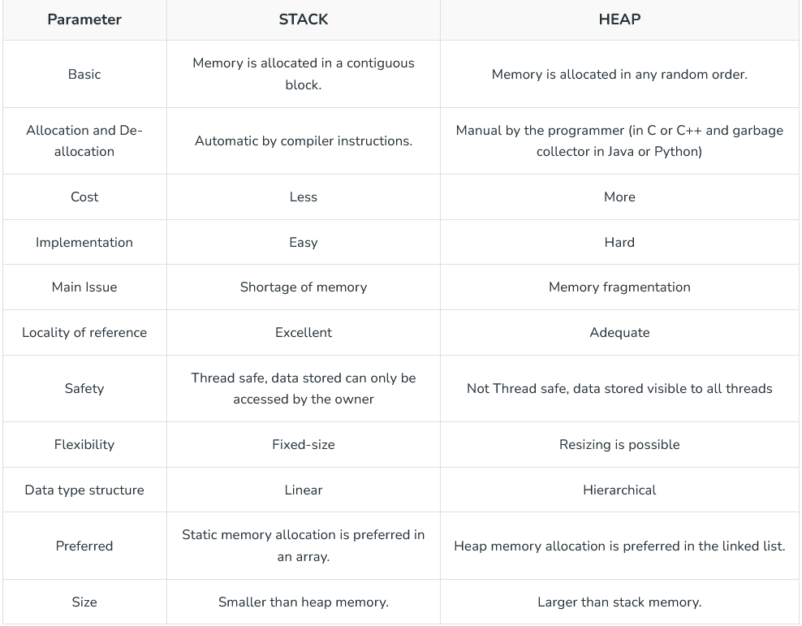
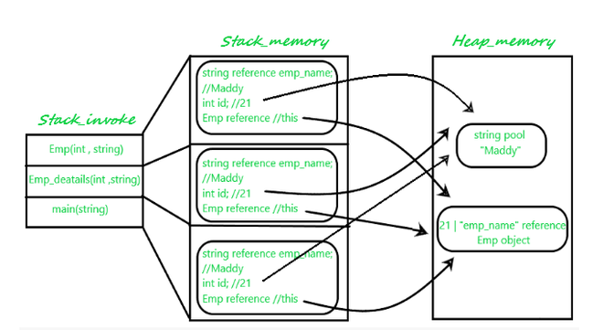

# functions

Created: May 16, 2026 7:44 AM

static variables and methods Are stored in the STACK MEMORY.

Dynamic variable are stored in the HEAP MEMORY.

<aside>
💡

Function operate  in a FIFO concept i.e the latest fx^n  is executed  first and popped out. 

</aside>

Functions:

access_modifier retrun type function_name( list of paramiters){
}

WHy do we use function?

- modularity
- don’t repeat yourself
- readability
- easy to debug

Type :- Parameterized and Non-parameterized 

### Recursive Function():

Function that calls it self repeatedly .

It has a base condition and a recursive condition ( Base condition is important as it returns the default values  ).

Pass By Value :

primitive data type are always pass by value ( The original data is not changed. )

Pass By Reference: 

The reference of the original value is passed and the original data can be changed . 

fx^n over-loading:

function name be same but it has different function parameters or return type.

eg:- void add ( int a, int b ) return a+b; 

and  void add ( int s, int b, int c ) return  a+b+c;

fx^n over-riding: 

The function must have same name , but the inner functionality of the the two function is completely different  and no. of parameter are same.

eg:- class A{ int add(int a, int b) return a+b;}

and  class B extends A {

@override  //This is impoertent for override

int add( int a, int b) return a* b;

}

Context of the function?

**Context in Java is a container (or a “holder”) for background information that an object needs to function correctly.**

Stack Vs heap?

How function uses stack and heap memory   . how it uses LVT ?

Difference  parameter and argument? 

Where are non-static variable stored? 

stored in heap memory

main function is always called first.